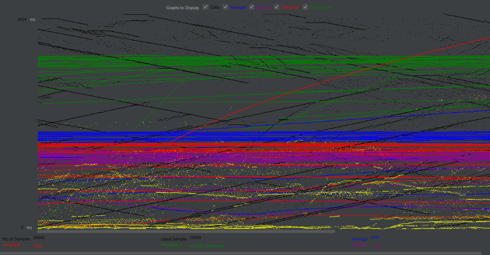
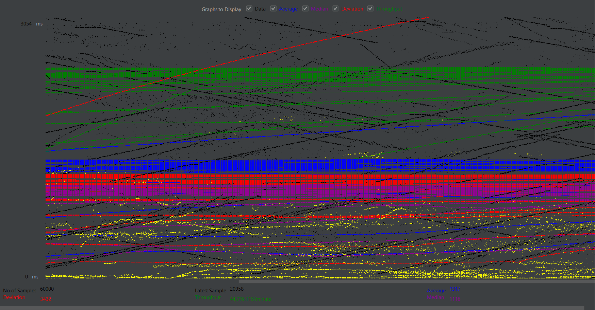
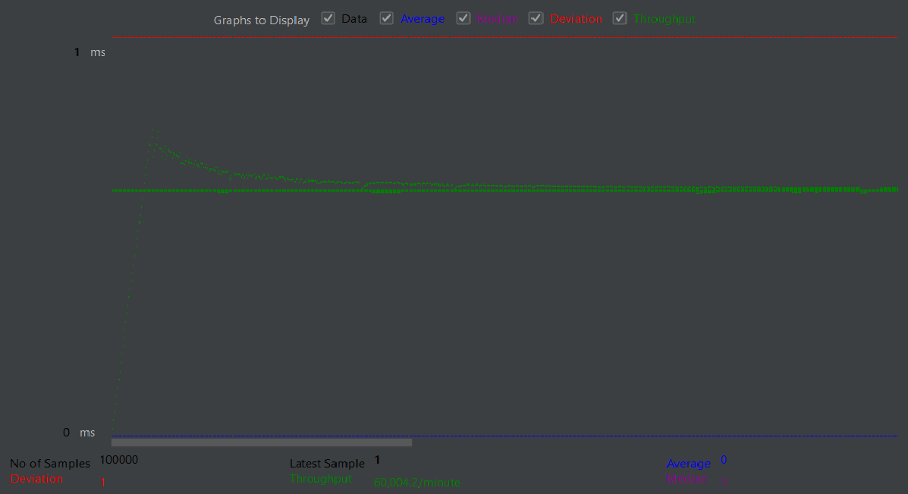
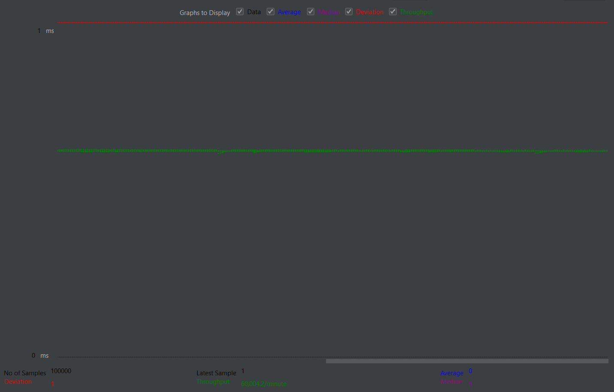
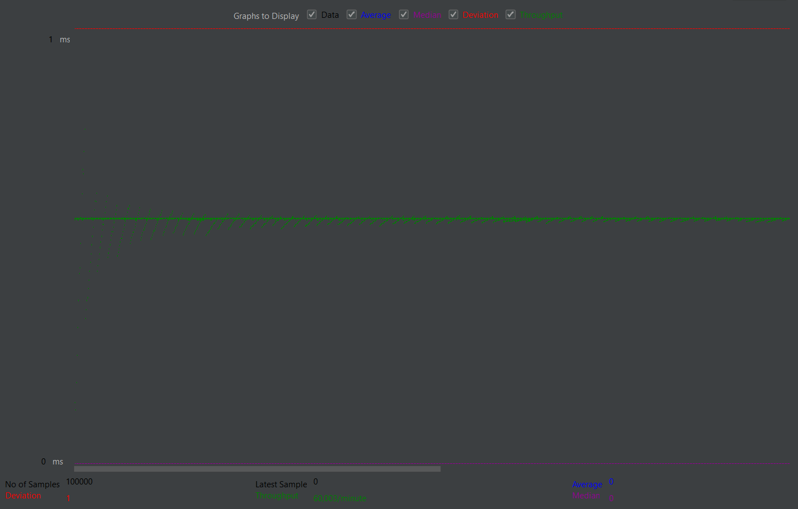
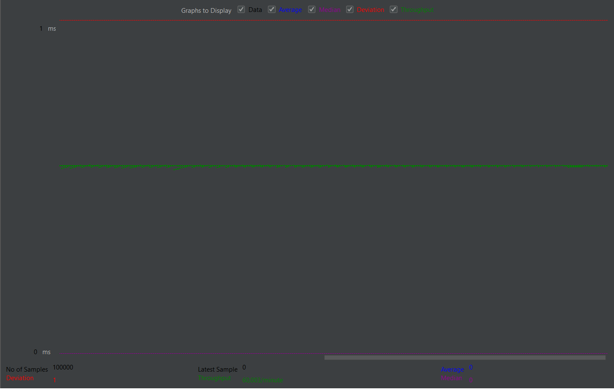

# 🚀 Java TCP Server Benchmarking

This project explores and compares **three distinct TCP server architectures** in Java, focusing on how each handles client connections under extreme load. The goal is to understand practical concurrency models, thread management techniques, and the performance implications of different designs using real-time benchmarking.

Through this project, I gained hands-on experience with **Java socket programming**, **thread-per-client models**, **lambda-based consumer abstractions**, and **scalable thread pool architectures**. Performance was rigorously evaluated using **Apache JMeter**, simulating over **600,000 client requests**, to measure metrics like **throughput**, **latency**, and **error rates**. These experiments helped me build strong intuition around multithreaded server design, synchronization bottlenecks, and efficient resource utilization.

---

## 🎯 Project Overview

The project implements and benchmarks the following three server types:

- A **Single-threaded blocking server** that processes one connection at a time
- A **Multi-threaded server** using the thread-per-client approach with `Consumer<Socket>` and Java lambdas
- A **Fixed thread pool server** using `ExecutorService` for scalable, memory-efficient concurrency

By comparing these, I was able to learn how different threading models impact server responsiveness, system stability, and scalability when faced with high-volume traffic.

---

## 📊 Performance Testing

Performance testing was conducted using [Apache JMeter](https://jmeter.apache.org/) to simulate massive concurrent loads on all three servers. The test configuration included:

- **Total Requests**: 100,000
- **Concurrent Threads**: 60,000
- **Ramp-up Period**: 60 seconds
- **Server Port**: 8010
- **Average Runtime per Test**: ~5–10 minutes

JMeter was used to analyze **response time distributions**, **percentile latencies**, **error percentages**, and **overall throughput** across the server types.

---

## 🧪 Server Architecture Breakdown & Results

### 🟡 Single-Threaded Server

This basic server accepts one client at a time and blocks on each connection. It's ideal for learning socket I/O but lacks any concurrency. This design suffered from significant queuing delays under load, resulting in a high error rate and severely degraded performance.

> 📝 **Note:** The single-threaded server was tested with **only 60,000 requests** instead of 100,000 due to its architectural limitations. Beyond this threshold, the server consistently timed out and failed to respond, demonstrating its unsuitability for handling high concurrency.

- **Average Response Time**: 1917 ms
- **99th Percentile**: 21,359 ms
- **Error Rate**: 30.29%
- **Throughput**: 746.26 req/min

### 📈 Graphs – Single-Threaded Server

  

**Key Insight:** This architecture demonstrated why single-threaded models cannot scale — connection queuing leads to timeouts and poor user experience under concurrency.

---

### 🟢 Multi-Threaded Server (Thread-per-Client)

Here, the server creates a new thread for each client connection. I used `Consumer<Socket>` and Java lambda expressions to encapsulate request handling logic, making the threading structure clean and functional.

- **Average Response Time**: 0 ms
- **99th Percentile**: 3 ms
- **Max Time**: 82 ms
- **Error Rate**: 0.00%
- **Throughput**: 1000.07 req/min

### 📈 Graphs – Multi-Threaded Server

**Key Insight:** This model achieved excellent responsiveness under moderate concurrency. However, I learned that unbounded thread creation can cause resource exhaustion at scale, making it unsuitable for large production systems.

---

### 🔵 Thread Pool Server (Fixed Thread Pool)

To overcome the pitfalls of unbounded threading, I implemented a thread pool using `ExecutorService`. With a fixed number of reusable threads (e.g., 20), the server efficiently handled connections without overwhelming system resources.

- **Average Response Time**: 0 ms
- **99th Percentile**: 2 ms
- **Max Time**: 67 ms
- **Error Rate**: 0.00%
- **Throughput**: 1000.05 req/min

### 📈 Graphs – Thread Pool Server

**Key Insight:** The thread pool architecture delivered stable, predictable performance. I saw how pre-allocating threads allowed the system to scale gracefully while keeping memory usage in check. This is the architecture I would recommend for real-world, production-grade servers.

---

## 📈 Summary Table of Results

| Server Type         | Avg Time | 99% Time | Max Time | Error % | Throughput      |
| ------------------- | -------- | -------- | -------- | ------- | --------------- |
| Single-threaded     | 1917 ms  | 21359 ms | 22909 ms | 30.29%  | 746.26 req/min  |
| Multi-threaded      | 0 ms     | 3 ms     | 82 ms    | 0.00%   | 1000.07 req/min |
| Thread pool (Fixed) | 0 ms     | 2 ms     | 67 ms    | 0.00%   | 1000.05 req/min |

---

## 💡 Core Learnings

This project served as an in-depth study of **Java concurrency and multithreading**, sharpening my understanding of the following:

- The importance of **parallelism and thread management** in scalable server design
- How **thread-per-client** models improve latency but demand high memory
- Why **thread pooling** is a best practice for managing large-scale client loads
- Usage of Java's `Thread`, `Consumer<Socket>`, lambda expressions, and `ExecutorService`
- Conducting performance benchmarking using **Apache JMeter**
- Analyzing system metrics like latency percentiles, error rates, and throughput to draw architectural conclusions

These insights directly contribute to my ability to build **robust, performant backend systems** in real-world environments.

---

## 📦 How to Run This Project

### 💻 Prerequisites

- Java 8 or higher
- Apache JMeter
- Git

### 🔧 Compilation

# 📦 Clone the repository
git clone https://github.com/pratyush2905/Multithreaded-Web-Server.git
cd Multithreaded-Web-Server

# 🔧 Compile all server implementations
javac SingleThreaded/Server.java MultiThreaded/Server.java ThreadPool/Server.java

# 🚀 Run the Single-threaded server
java -cp SingleThreaded Server

# 🚀 Run the Multi-threaded server
java -cp MultiThreaded Server

# 🚀 Run the Thread pool server
java -cp ThreadPool Server

